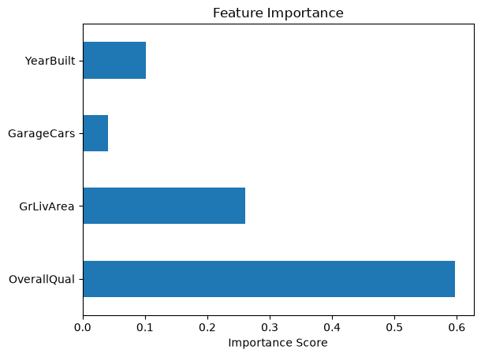
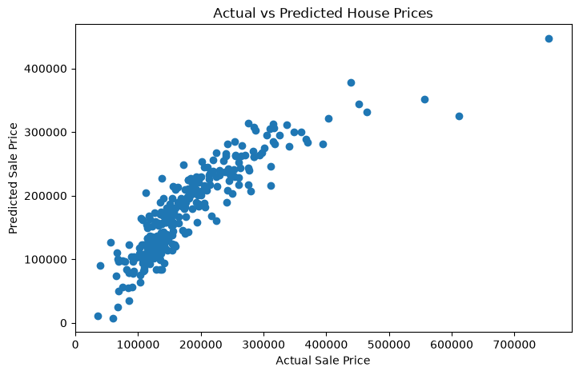

# House Price Prediction

**Jinran Cheng** · Python data science portfolio

Compare interpretable regression and tree-based models to understand which housing attributes are associated with sale prices.

**Skills demonstrated:** Tabular regression · exploratory analysis · feature engineering · cross-validation

## Results and interpretation

| Model | Test R² |
|---|---:|
| Linear Regression — 4 features | 0.76 |
| Random Forest — 4 features | 0.86 |
| Random Forest — 10 features | 0.88 |

Overall quality was the strongest predictor in the four-feature Random Forest. Expanding the feature set improved the recorded test score.

Metrics above are rounded from the original saved analysis; they are not newly benchmarked results.

## Explore the analysis

- [01 data exploration](notebooks/01_data_exploration.ipynb)
- [02 data cleaning](notebooks/02_data_cleaning.ipynb)
- [03 data correlation](notebooks/03_data_correlation.ipynb)
- [04 new variable](notebooks/04_new_variable.ipynb)
- [05 data preprocessing](notebooks/05_data_preprocessing.ipynb)
- [06 modeling](notebooks/06_modeling.ipynb)

The numbered notebooks document the workflow, from data exploration to modeling. Saved outputs let you review the analysis directly on GitHub.

## Selected visualizations





## Run locally

1. Clone this repository and open its folder.
2. Create an environment and install dependencies:

```bash
python -m venv .venv
source .venv/bin/activate  # Windows: .venv\Scripts\activate
python -m pip install -r requirements.txt
mkdir -p data/raw
python -m jupyter lab
```

3. Obtain the data described below and place it in `data/raw/`.
4. Open the notebooks from their notebook folder and run cells from top to bottom. Relative data paths assume that working directory. For projects with multiple notebooks, follow their numeric order; each loads its own source data.

### Dataset

Kaggle Ames Housing / House Prices dataset. Place train.csv and test.csv in data/raw/. The modeling notebook uses train.csv.

Raw datasets are not redistributed here. Use the original provider's terms and permissions. Results may vary with dataset versions and package versions. Dependencies list the directly used libraries; a fully locked environment has not been validated.

## Limitations and next steps

Scores come from the saved notebook run using an 80/20 random split. Model variants were compared on the same test set, so an untouched final holdout and nested cross-validation would provide a stronger estimate of generalization. This is a portfolio analysis, not a production valuation system.

## Project structure

- `README.md`: project overview, results and setup
- `requirements.txt`: direct Python dependencies
- `notebooks/`: documented analysis and saved outputs
- `images/`: selected plots
- `data/raw/`: local source datasets (excluded from Git)
